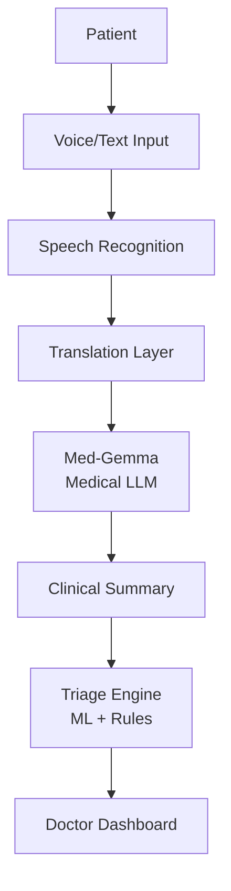

# Product Requirement Document (PRD): AI Border Triage System

## 1. Product Overview
**Product Name:** AI Border Triage  
**Tagline:** Bridging Languages, Saving Lives  

**Product Description:**  
AI Border Triage เป็นระบบคัดกรองผู้ป่วยเบื้องต้น (AI-assisted triage system) ที่ใช้ปัญญาประดิษฐ์ในการช่วยวิเคราะห์อาการผู้ป่วยหลายภาษา เพื่อช่วยบุคลากรทางการแพทย์ในพื้นที่ชายแดนที่มีข้อจำกัดด้านภาษาและทรัพยากร

ระบบสามารถ:
- รับข้อมูลผู้ป่วยจากเสียงหรือข้อความ
- แปลภาษาหลายภาษา
- วิเคราะห์อาการ
- สรุปข้อมูลทางการแพทย์
- จัดระดับความเร่งด่วนของผู้ป่วย

โดยใช้ Medical LLM (Med-Gemma) ร่วมกับ Machine Learning และ Rule-based triage system ระบบนี้ทำหน้าที่เป็น **Clinical Decision Support Tool** ไม่ได้ใช้แทนแพทย์

---

## 2. Problem Statement
โรงพยาบาลและคลินิกบริเวณชายแดนเผชิญกับปัญหา:
1. **Language Barrier:** ผู้ป่วยใช้หลายภาษา เช่น ไทย, พม่า, กะเหรี่ยง ทำให้การสื่อสารระหว่างผู้ป่วยและบุคลากรทางการแพทย์มีความยากลำบาก
2. **Limited Medical Staff:** โรงพยาบาลขนาดเล็กมีบุคลากรจำกัด ทำให้การคัดกรองผู้ป่วยใช้เวลานาน
3. **Triage Delays:** การซักประวัติผู้ป่วยใช้เวลานาน ทำให้ผู้ป่วยฉุกเฉินอาจไม่ได้รับการรักษาทันเวลา
4. **High Risk of Miscommunication:** ความเข้าใจผิดจากภาษาอาจทำให้เกิดการวินิจฉัยผิดพลาด

---

## 3. Objectives
**Primary Objectives:**
- พัฒนาระบบ AI สำหรับคัดกรองผู้ป่วยเบื้องต้น
- ลดเวลาการคัดกรองผู้ป่วย
- รองรับการสื่อสารหลายภาษา
- ช่วยแพทย์และพยาบาลตัดสินใจเร็วขึ้น

**Target Metrics:**

| Metric | Target |
|---|---|
| Triage Time | ลดลง ≥ 40% |
| Triage Accuracy | ≥ 85% |
| User Satisfaction | ≥ 4.5/5 |
| Languages Supported | ≥ 3 |

---

## 4. Target Users
**Primary Users:**
- **Nurses:** ใช้ระบบเพื่อช่วยซักประวัติผู้ป่วย
- **Doctors:** ใช้ข้อมูลที่สรุปโดย AI เพื่อตัดสินใจรักษา
- **Patients:** สามารถอธิบายอาการของตนเองผ่านระบบหลายภาษา

**Secondary Users:**
- Border hospitals
- Rural clinics
- Refugee health centers
- Public health agencies

---

## 5. System Scope
**In Scope:**
- Multilingual symptom input (Voice recognition, Text input)
- AI symptom analysis
- Clinical summary generation
- Triage classification
- Real-time dashboard

**Out of Scope:**
- Disease diagnosis
- Prescribing medication
- Full electronic medical record system

---

## 6. Core Features

### 6.1 Multilingual Input System
- **Description:** รับข้อมูลผู้ป่วยหลายภาษา
- **Supported Input:** Voice input, Text input
- **Languages (Phase 1):** Thai, Burmese, Karen

### 6.2 AI Symptom Interview
AI จะถามคำถามเพิ่มเติมจากอาการที่ผู้ป่วยให้มา
*ตัวอย่าง:*
> **ผู้ป่วย:** เจ็บหน้าอก  
> **AI:** เจ็บตั้งแต่เมื่อไร  
> **AI:** หายใจลำบากหรือไม่  
> **AI:** มีไข้หรือไม่  

### 6.3 Clinical Summary Generator
ใช้ Med-Gemma เพื่อสร้าง Medical Summary
*ตัวอย่าง output:*
```text
Chief Complaint: Chest pain
Symptoms: Shortness of breath, Dizziness
Risk Level: High
```

### 6.4 AI Triage Classification
ระบบจัดระดับความเร่งด่วนของผู้ป่วย

**Triage Levels:**

| Level | Description |
|---|---|
| Critical | Immediate care |
| Urgent | <30 minutes |
| Moderate | 1-2 hours |
| Mild | Wait for queue |

**Triage Decision Model:** 
- Hybrid approach (Machine Learning Model + Rule-based Medical Safety System)
- Rule-based จะใช้สำหรับ **Red Flag** เช่น:
  - Chest pain
  - Severe bleeding
  - Loss of consciousness

### 6.5 Medical Dashboard
แสดงข้อมูลให้แพทย์และพยาบาล โดย Dashboard แสดง:
- Patient queue
- Risk level
- Clinical summary
- Language translation
- Triage classification

---

## 7. System Architecture
**Architecture Overview:**



---

## 8. AI Models
**1. Medical LLM (Med-Gemma):**
- **ใช้สำหรับ:** Symptom understanding, Follow-up question generation, Medical summary

**2. Machine Learning Model:**
- **ใช้สำหรับ:** Triage classification
- **Input:** symptoms, duration, severity
- **Output:** triage level

---

## 9. Non-Functional Requirements
- **Performance:** Response time < 3 seconds, Full triage process < 5 minutes
- **Security:** End-to-end encryption, Data anonymization, PDPA compliance
- **Reliability:** System uptime ≥ 99%, Offline mode supported

---

## 10. AI Safety
เพื่อป้องกันความผิดพลาดของ AI ระบบมี:
- **Human-in-the-loop:** แพทย์เป็นผู้ตัดสินใจขั้นสุดท้าย
- **Red Flag Rules:** กรณีอาการรุนแรง ระบบจะทำการแจ้งเตือนทันที และส่งผู้ป่วยไป Critical queue
- **AI Transparency:** แสดง reasoning และ symptom evidence

---

## 11. Evaluation Plan
ระบบจะถูกประเมินจาก:

| Metric | Method |
|---|---|
| Triage accuracy | Compare with nurse triage |
| Response time | System latency |
| User satisfaction | Survey |
| Clinical safety | Expert review |

---

## 12. Implementation Roadmap
- **Phase 1 (Prototype):** 3 languages, text input, basic triage
- **Phase 2 (Hospital integration):** voice input, HIS integration, real-time dashboard
- **Phase 3 (Full deployment):** mobile application, cross-border healthcare network

---

## 13. Risks and Mitigation

| Risk | Mitigation |
|---|---|
| AI hallucination | Rule-based safety layer |
| Translation errors | Multilingual validation |
| Privacy concerns | Encryption |
| Over-reliance on AI | Doctor oversight |

---

## 14. Expected Impact
AI Border Triage สามารถช่วย:
- ลดเวลาการคัดกรองผู้ป่วย
- ลดภาระบุคลากรทางการแพทย์
- เพิ่มความปลอดภัยของผู้ป่วย
- รองรับระบบสาธารณสุขชายแดน

---
**สรุป:**
AI Border Triage เป็นระบบ AI ที่ช่วยคัดกรองผู้ป่วยหลายภาษาโดยใช้ Medical LLM และ Machine Learning เพื่อช่วยแพทย์และพยาบาลทำงานได้รวดเร็วและปลอดภัยมากขึ้น ระบบถูกออกแบบให้เป็น AI-assisted medical system ที่ทำงานร่วมกับบุคลากรทางการแพทย์
